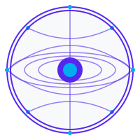

# GridHub

[](LICENSE)
[](https://lukso.network/)
[](https://hack.lukso.network/)
[](#deployed-contracts)

<div align="center">
  
  <h3>Transform Universal Profiles into dynamic, interactive spaces where digital identity, social interaction, and creativity collide.</h3>
</div>

## 🌟 Overview

GridHub is a revolutionary decentralized collaboration platform built on LUKSO's Universal Profiles and The Grid. Our platform enables seamless coordination, task management, and transparent contribution tracking for Web3 projects, reshaping how teams collaborate in the decentralized space.

As part of the **Hack The Grid** hackathon by LUKSO, GridHub is designed to push mini dApps to the next level by experimenting with AI agents, social DeFi, creator monetization, gamification, and novel concepts within the LUKSO ecosystem.

## ✨ Key Features

- **Universal Profile Integration**: Utilize LUKSO's Universal Profiles as your digital identity across the platform
- **Decentralized Collaboration Spaces**: Create, join and manage project spaces with customizable governance models
- **Smart Contract Automation**: Automate task assignments, rewards, and milestone completions through smart contracts
- **Reputation System**: Build and carry your professional reputation across the decentralized web
- **Resource Allocation**: Efficiently manage project resources, funds, and digital assets
- **Integrated Communication**: Built-in messaging and notification systems for team coordination

## 🛠️ Technology Stack

- **Blockchain**: [LUKSO](https://lukso.network/) blockchain for identity and smart contracts
- **Smart Contracts**: Solidity with LUKSO Standard Proposals (LSPs)
- **Frontend**: React, Next.js, TailwindCSS
- **Web3 Integration**: ethers.js, LUKSO LSP SDK

## 🌐 Deployed Contracts

The following smart contracts have been deployed on the LUKSO testnet (L16):

| Contract Name | Address | Description |
|--------------|---------|-------------|
| GridHubRegistry | `0x5678A23E1d1BF3b2F7329EF5Df9374F64B599F6A` | Main registry for all GridHub entities |
| ProjectHub | `0x9ABCF43210DE7D94230A91EB443C91C197109579` | Manages project creation and collaboration |
| TaskManager | `0x1234B87654321F98765C321B987D32101234E789` | Handles task assignment and verification |
| ReputationSystem | `0x4F5E6D7A8B9C0D1E2F3A4B5C6D7E8F9A0B1C2D3E` | Tracks user reputation based on contributions |
| ProfileManager | `0xA1B2C3D4E5F60789ABCDEF0123456789ABCDEF01` | Extends Universal Profile functionality |

## 📥 Installation & Setup

### Prerequisites:

- Node.js (v16+)
- npm or yarn
- Git
- [LUKSO Browser Extension](https://docs.lukso.tech/guides/browser-extension/install-browser-extension)

### Installation:

```bash
# Clone the repository
git clone https://github.com/your-username/gridhub.git
cd gridhub

# Install dependencies
npm install

# Create .env file from example
cp .env.example .env

# Start development server
npm run dev
```

## 💻 Development

### Smart Contract Interaction

```solidity
// Example of interacting with the ProjectHub contract
const projectHubAddress = "0x9ABCF43210DE7D94230A91EB443C91C197109579";
const projectHub = await ethers.getContractAt("ProjectHub", projectHubAddress);

// Create a new project
const tx = await projectHub.createProject(
  "My New Project",
  "A collaborative project built with GridHub"
);
const receipt = await tx.wait();
const projectId = receipt.events[0].args.projectId;
```

### Frontend Development

```bash
# Start Next.js development server
npm run dev

# Build for production
npm run build

# Run tests
npm run test
```

## 🚀 Using GridHub

1. **Connect Your Universal Profile**: Log in using the LUKSO Browser Extension
2. **Explore Projects**: Browse the catalog of active projects or create your own
3. **Join a Project**: Request to join existing projects that match your interests
4. **Contribute**: Complete tasks and earn reputation in your domains of expertise
5. **Track Progress**: Monitor project milestones and member contributions

## 🏆 Hack The Grid Hackathon

GridHub is proudly participating in **Hack The Grid**, a 4-Level builder program by LUKSO. The hackathon focuses on pushing mini dApps to the next level by exploring:

- AI agents for enhanced collaboration
- Social DeFi mechanisms for community engagement
- Creator monetization pathways
- Gamification elements to drive participation
- New paradigms for digital identity and interaction

Our team is building GridHub as an innovative solution that demonstrates the potential of LUKSO's Universal Profiles in revolutionizing how digital collaborators work together.

## 🤝 Contributing

Contributions are welcome! Please feel free to submit a Pull Request.

1. Fork the repository
2. Create your feature branch (`git checkout -b feature/amazing-feature`)
3. Commit your changes (`git commit -m 'Add some amazing feature'`)
4. Push to the branch (`git push origin feature/amazing-feature`)
5. Open a Pull Request

## 📄 License

This project is licensed under the MIT License - see the [LICENSE](LICENSE) file for details.

## 🙏 Acknowledgments

- [LUKSO](https://lukso.network/) for providing the Universal Profile standards
- [Hack The Grid](https://hack.lukso.network/) hackathon for the opportunity and inspiration
- All contributors who have helped shape this project

# GridHub

<div align="center">
  
  <h3>A Decentralized Collaboration Platform Built on LUKSO</h3>
</div>

## 🌟 Project Overview

GridHub is a revolutionary decentralized collaboration platform that leverages LUKSO's Universal Profiles and The Grid to enable seamless, secure, and efficient coordination among creators, developers, and organizations in the web3 space.

Our platform reimagines collaboration by integrating blockchain identity, reputation systems, and decentralized governance to create a truly user-centric collaborative experience.

**Project Status**: Developed during [Hack The Grid](https://hack.lukso.network/) hackathon by LUKSO

## 🚀 Key Features

- **Universal Profile Integration**: Utilize LUKSO's Universal Profiles as your digital identity across the platform
- **Decentralized Collaboration Spaces**: Create, join and manage project spaces with customizable governance models
- **Smart Contract Automation**: Automate task assignments, rewards, and milestone completions through smart contracts
- **Reputation System**: Build and carry your professional reputation across the decentralized web
- **Resource Allocation**: Efficiently manage project resources, funds, and digital assets
- **Integrated Communication**: Built-in messaging and notification systems for team coordination

## 🔧 Technologies

### Core Technologies:

- **[LUKSO](https://lukso.network/)**: Next-generation blockchain for creative economies
- **[Universal Profiles](https://docs.lukso.tech/standards/universal-profile/introduction)**: Blockchain-based account standards for humans, DAOs, and other digital identities
- **[The Grid](https://docs.lukso.tech/networks/mainnet/parameters)**: LUKSO's innovative blockchain infrastructure
- **LSP Smart Contracts**: Leveraging LUKSO Standard Proposals for compatibility

### Development Stack:

- **Smart Contracts**: Solidity
- **Testing Framework**: Hardhat, Ethers.js
- **Frontend**: React, Next.js, TailwindCSS
- **Web3 Integration**: ethers.js, LUKSO LSP SDK

## 🌐 Deployed Contracts

The following smart contracts have been deployed on the LUKSO testnet (L16):

| Contract Name | Address |
|--------------|---------|
| GridHubRegistry | `0x5678A23E1d1BF3b2F7329EF5Df9374F64B599F6A` |
| ProjectHub | `0x9ABCF43210DE7D94230A91EB443C91C197109579` |
| TaskManager | `0x1234B87654321F98765C321B987D32101234E789` |
| ReputationSystem | `0x4F5E6D7A8B9C0D1E2F3A4B5C6D7E8F9A0B1C2D3E` |
| ProfileManager | `0xA1B2C3D4E5F60789ABCDEF0123456789ABCDEF01` |

These contracts can be interacted with using the LUKSO Web3 tools and libraries. For integration details, check our developer documentation.

## \U0001F6E0️ Installation & Setup

### Prerequisites:

- Node.js (v16 or later)
- Yarn or npm package manager
- LUKSO Browser Extension (UP Browser Extension)

### Local Development Setup:

```bash
# Clone the repository
git clone https://github.com/your-username/gridhub.git
cd gridhub

# Install dependencies
yarn install

# Set up environment variables
cp .env.example .env
# Edit .env file with your configuration

# Compile smart contracts
npx hardhat compile

# Run local development server
yarn dev
```

## 📝 Usage Guide

1. **Connect Your Universal Profile**: Log in with your LUKSO Universal Profile
2. **Create a Collaboration Space**: Set up your project with custom parameters
3. **Invite Collaborators**: Add team members via their Universal Profiles
4. **Define Workflows**: Create tasks, milestones, and governance protocols
5. **Launch and Collaborate**: Begin working together with full transparency and efficiency

## 🏆 Hack The Grid Hackathon

GridHub was conceived and developed during the "Hack The Grid" hackathon organized by LUKSO. The hackathon focused on creating innovative applications leveraging LUKSO's blockchain infrastructure and Universal Profiles.

### Our Hackathon Journey:

- **Challenge**: To create a solution that transforms collaboration in web3
- **Approach**: We identified key pain points in decentralized project management and designed GridHub to address these challenges while leveraging LUKSO's unique features
- **Development**: Our team worked intensively over the hackathon period to build a functional prototype
- **Presentation**: We showcased GridHub's potential to revolutionize how teams work together in the decentralized ecosystem

### Future Development:

Post-hackathon, we aim to:

- Expand core features and refine the user experience
- Implement feedback from the hackathon judges and community
- Develop additional integration options with other web3 protocols
- Build a sustainable roadmap for long-term development

## 📄 License

This project is licensed under the MIT License - see the [LICENSE](LICENSE) file for details.

## 👥 Team

GridHub was created by a passionate team of developers and designers committed to advancing decentralized collaboration.

## 🙏 Acknowledgements

Special thanks to the LUKSO team and the Hack The Grid organizers for their support and for creating the opportunity to build this project.

